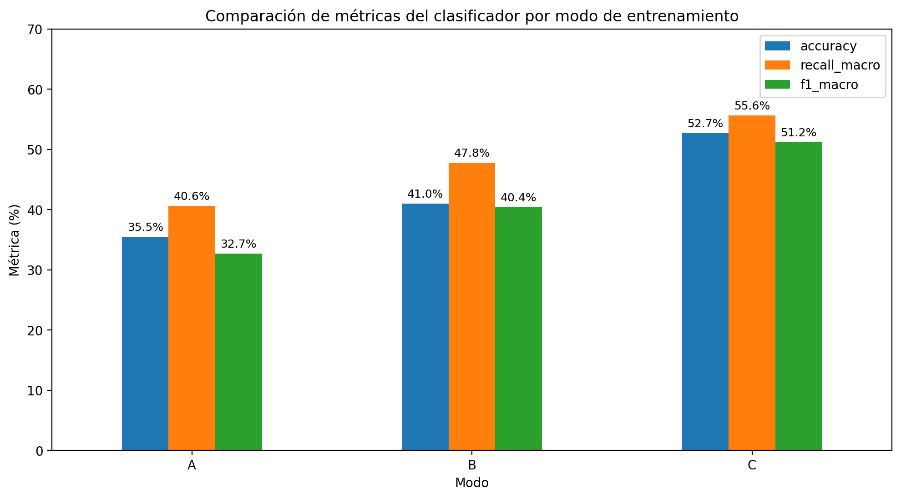

# ARRYS — Generación de Señales ECG Sintéticas con TCN-cVAE

[](https://www.python.org/)
[](LICENSE)
[](#estado-del-proyecto)

Repositorio del Grupo 2 para generación condicionada de latidos ECG sintéticos y evaluación de su utilidad en clasificación de arritmias. El pipeline final combina una **Temporal Convolutional Network** con un **conditional Variational Autoencoder (TCN-cVAE)** y se evalúa mediante TSTR/TRTS sobre señales reales no vistas.

link Demo: [ARRYS](https://arrys-generador-arritmias.streamlit.app/)

> **Uso exclusivamente académico y de investigación.** Las señales y predicciones no son un dispositivo médico, no han sido validadas clínicamente y no deben utilizarse para diagnóstico.

## Estado del proyecto

La estructura está preparada para una entrega final o casi final: app, paquete de inferencia, scripts, notebooks, resultados estructurados, figuras, paper, documentación, pruebas y validación automática. Antes de publicar la versión `v1.0.0` deben copiarse los modelos desde la carpeta antigua `App/Modelo/` a `models/` y resolverse los puntos listados en [`docs/KNOWN_ISSUES.md`](docs/KNOWN_ISSUES.md).

## Resultados principales

| Modo | Entrenamiento → prueba | Accuracy | Recall macro | F1 macro |
|---|---|---:|---:|---:|
| A | Real → real | 35.47% | 40.64% | 32.73% |
| B | Sintético → real | 41.03% | 47.83% | 40.38% |
| C | Real + sintético → real | **52.70%** | **55.65%** | **51.21%** |
| D | Real → sintético | 34.56% | 50.30% | 32.69% |

El modo C mejora el recall macro en **15.01 puntos porcentuales** y el F1 macro en **18.48 puntos porcentuales** frente al baseline A. Los valores auditables se encuentran en [`results/metrics/`](results/metrics/).



## Características del experimento final

- Dataset: PhysioNet ECG-Arrhythmia, versión 1.0.0.
- Señales de 12 derivaciones, muestreadas a 500 Hz.
- Ventanas de latido de 650 ms y 325 muestras, centradas alrededor del pico R.
- Espacio latente de 32 dimensiones.
- Bloques TCN con dilataciones `1, 2, 4, 8, 16, 32`.
- Seis condiciones del generador: `AF`, `AFL`, `NSR`, `Others`, `SB`, `ST`.
- Clasificador downstream independiente con Focal Loss.
- Evaluación distribucional, morfológica, TSTR y TRTS.

## Estructura

```text
.
├── app/                       # Interfaz Streamlit final
├── config/                    # Configuración documentada
├── data/                      # Datos locales; no se versionan
├── docs/                      # Dataset, model card, resultados y reproducibilidad
│   └── paper/                 # Manuscrito del proyecto
├── figures/                   # Figuras originales del informe
├── legacy/                    # Código MIT-BIH y apps anteriores
├── models/                    # Modelos finales y banco latente
├── notebooks/                 # Reproducción, inferencia y entrenamiento
├── results/metrics/           # Métricas en CSV
├── scripts/                   # Generación, validación, migración y gráficos
├── src/arrys/                 # Paquete Python reutilizable
├── tests/                     # Pruebas rápidas
├── requirements-app.txt       # Dependencias mínimas de la app
├── requirements.txt           # Dependencias de investigación
└── requirements-dev.txt       # Desarrollo, notebooks y pruebas
```

## Instalación rápida

### 1. Clonar

```bash
git clone https://github.com/Nestor20193767/Grupo2---Proyecto.git
cd Grupo2---Proyecto
```

### 2. Crear el entorno

```bash
python -m venv .venv
```

Linux/macOS:

```bash
source .venv/bin/activate
```

Windows PowerShell:

```powershell
.venv\Scripts\Activate.ps1
```

### 3. Instalar

Solo aplicación e inferencia:

```bash
pip install --upgrade pip
pip install -r requirements-app.txt
pip install -e .
```

Entorno completo de investigación:

```bash
pip install -r requirements.txt
pip install -e .
```

## Modelos

Los modelos existentes deben quedar en `models/` junto con sus pesos externos:

```text
models/
├── tcncvae_decoder_physionet.onnx
├── tcncvae_decoder_physionet.onnx.data
├── tcncvae_encoder_physionet.onnx
├── clf_aug_physionet.onnx
├── clf_aug_physionet.onnx.data
├── clf_aug_physionet.pt
├── label_encoder_physionet.pkl
└── latent_bank.npz
```

Desde el repositorio antiguo:

```bash
python scripts/migrate_repository.py --source . --destination . --dry-run
python scripts/migrate_repository.py --source . --destination .
python scripts/check_models.py --strict
```

Consulte [`models/README.md`](models/README.md) para Git LFS o publicación mediante GitHub Releases.

## Ejecución

### Aplicación Streamlit

```bash
streamlit run app/streamlit_app.py
```

La interfaz permite seleccionar la clase, controlar el ruido latente, generar varios latidos, comparar morfologías, descargar CSV y verificar señales mediante el clasificador, cuando está disponible.

### Script reproducible de inferencia

```bash
python scripts/generate_ecg.py \
  --class-name NSR \
  --n 8 \
  --noise 0.8 \
  --seed 42 \
  --classify
```

Los archivos se guardan en `outputs/`, que se mantiene fuera de Git.

### Docker

```bash
docker build -t arrys .
docker run --rm -p 8501:8501 arrys
```

## Notebooks y reproducción

```bash
jupyter lab
```

Empiece por:

1. `notebooks/00_reproduce_reported_results.ipynb` para verificar las tablas.
2. `notebooks/01_inference_demo.ipynb` para ejecutar inferencia con semilla fija.
3. `notebooks/02_training_tcn_cvae_physionet.ipynb` para el entrenamiento, después de migrar el archivo original.

Para regenerar los gráficos desde CSV:

```bash
python scripts/reproduce_figures.py
```

## Verificación de la entrega

```bash
pip install -r requirements-dev.txt
pip install -e .
python scripts/check_repository.py
python -m compileall app src scripts tests
pytest
```

Mientras los binarios todavía no hayan sido copiados a esta plantilla, use únicamente durante la preparación:

```bash
python scripts/check_repository.py --allow-missing-models
```

## Documentación

- [Dataset y preprocesamiento](docs/DATASET.md)
- [Model Card](docs/MODEL_CARD.md)
- [Resultados](docs/RESULTS.md)
- [Reproducibilidad](docs/REPRODUCIBILITY.md)
- [Guía directa para actualizar GitHub](COMO_ACTUALIZAR_GITHUB.md)
- [Migración desde la estructura antigua](docs/MIGRATION.md)
- [Inconsistencias y pendientes](docs/KNOWN_ISSUES.md)
- [Paper del proyecto](docs/paper/paper_ieee_arrys.docx.pdf)

## Equipo

- Marx Ríos
- Nestor Allende
- Renzo Luna
- Universidad Peruana Cayetano Heredia — Ingeniería Biomédica

## Licencia y citación

El código se distribuye bajo licencia MIT. Consulte [`CITATION.cff`](CITATION.cff) para citar el software. El dataset y los modelos derivados pueden tener condiciones adicionales; verifique la licencia de PhysioNet antes de redistribuirlos.
